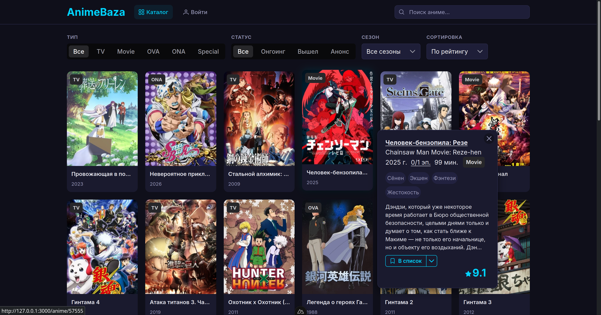
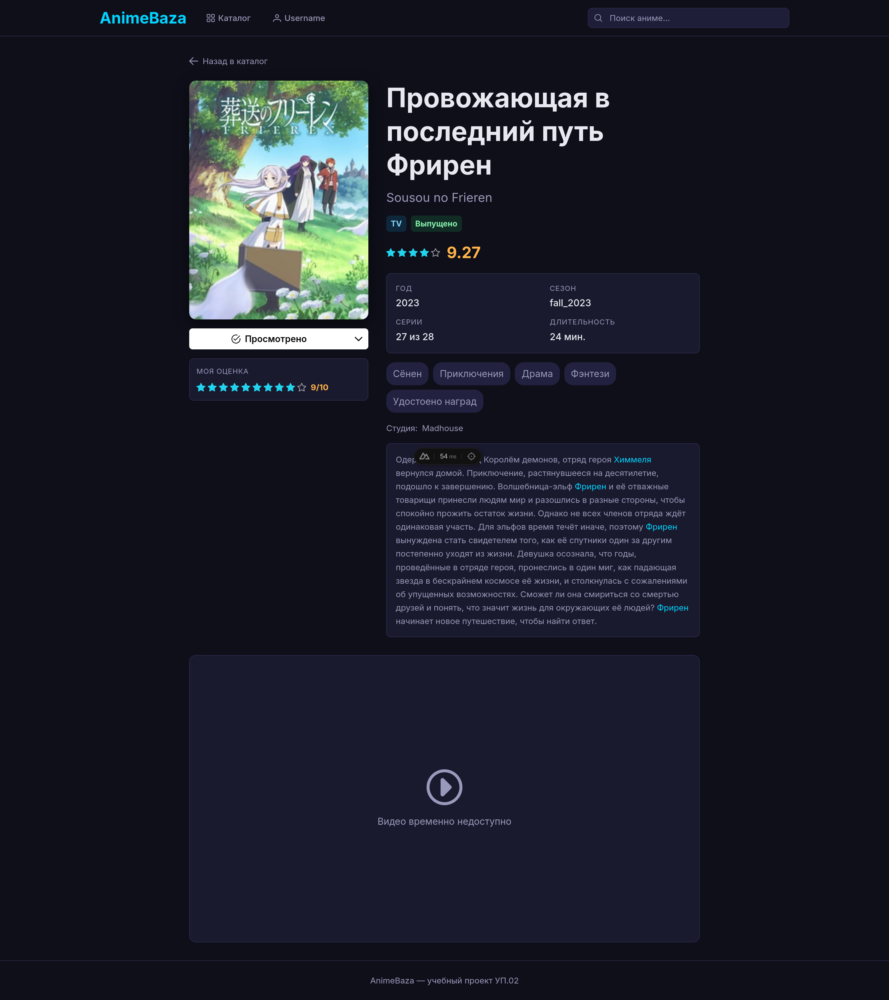
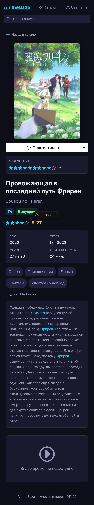
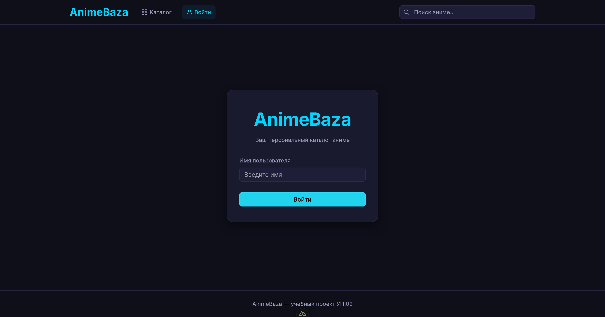
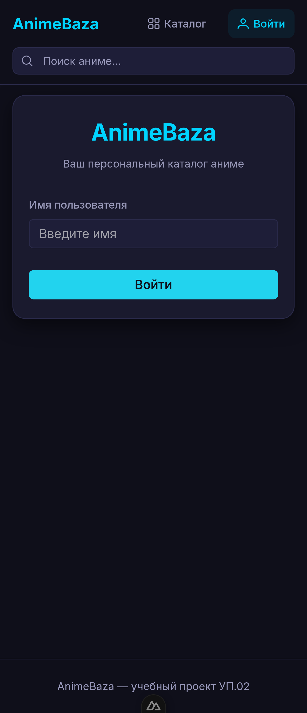
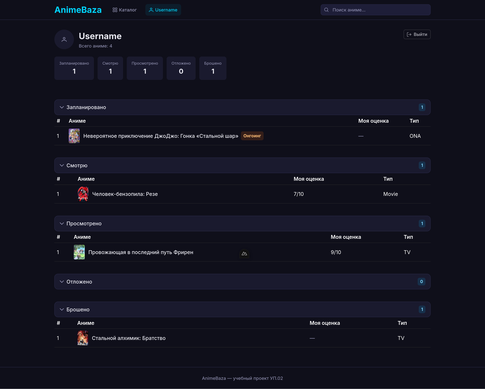
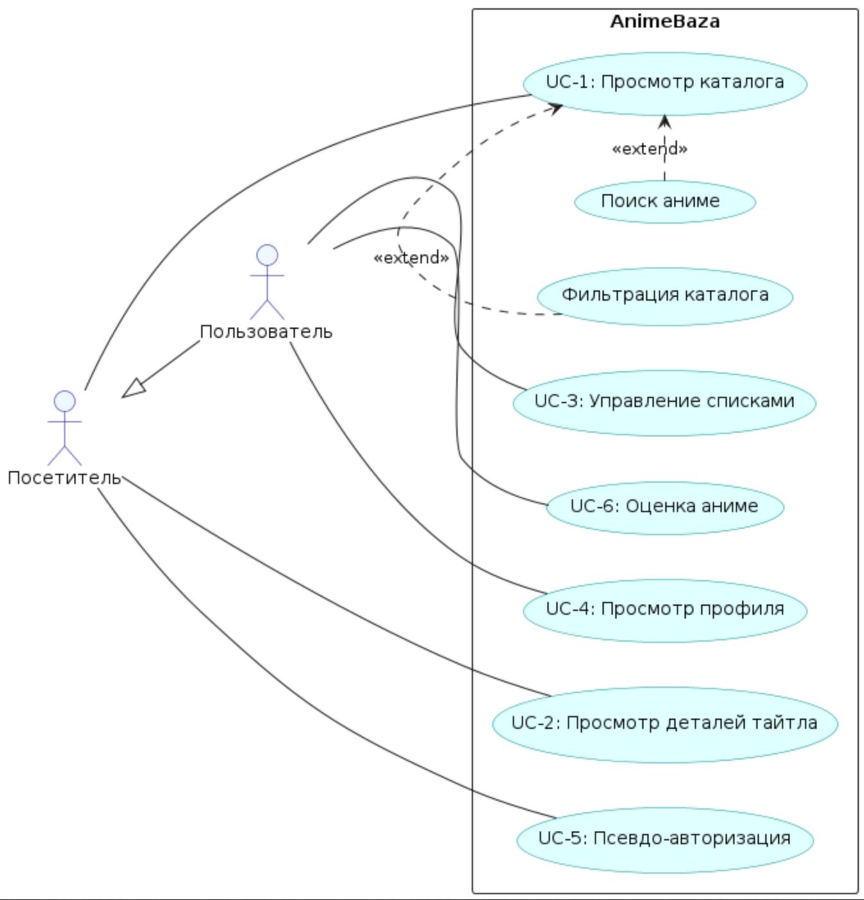

# AnimeBaza — Веб-каталог аниме

> Дипломный проект. Учебная практика УП.02.

Веб-приложение-каталог аниме: поиск, фильтрация, просмотр информации о тайтлах, ведение персональных списков просмотра.
Данные — через Shikimori GraphQL API. Пользовательские данные — localStorage. Стек: Nuxt 4 + Vue 3 + TypeScript + PrimeVue 4.

---

## 1. Актуальность темы

Индустрия аниме переживает устойчивый рост: ежегодно выпускаются сотни новых тайтлов, аудитория по всему миру расширяется. Основные платформы для отслеживания аниме (Shikimori, MyAnimeList, AniDB) ориентированы на энциклопедический формат — каталогизация, рейтинги, обсуждения. Они предоставляют избыточную информацию и сложную навигацию, перегружая пользователя, который хочет просто найти, что посмотреть.

Большинство зрителей взаимодействуют с аниме через стриминговые сервисы (Crunchyroll, Netflix), но эти платформы не дают гибких инструментов для ведения собственных списков просмотра и не предоставляют единого каталога по всем тайтлам независимо от платформы.

**AnimeBaza** решает эту задачу: стриминговый UX с акцентом на каталог, быстрый поиск и управление персональными списками. Приложение не требует регистрации, работает сразу после открытия, данные синхронизируются через браузер.

## 2. Целевая аудитория

- **Любители аниме** — от новичков до опытных зрителей, которые хотят систематизировать просмотр, вести списки «запланировано / смотрю / просмотрено» и получать быстрый доступ к информации о тайтле.
- **Зрители с нескольких платформ** — те, кто смотрит аниме на разных стримингах (Crunchyroll, Netflix, Кинопоиск) и нуждается в едином каталоге-органайзере.
- **Студенты и молодые пользователи** — основная аудитория аниме, привыкшая к мобильным интерфейсам и быстрой навигации.

## 3. Функциональные возможности

### Посетитель (без авторизации)
- Просмотр каталога с сеткой карточек, постером, названием и типом тайтла.
- Hover-попап с детальной информацией: статус, рейтинг, жанры, описание, кнопка добавления в список.
- Фильтрация по типу (TV / Movie / OVA / ONA), статусу (онгоинг / вышел / анонс), сезону и году.
- Сортировка по дате выхода, популярности, рейтингу.
- Поиск по названию (debounced автопоиск + по Enter).
- Постраничная подгрузка через кнопку «Загрузить ещё».
- Детальная страница тайтла: большой постер, метаданные, жанры, описание, плеер-заглушка.
- Псевдо-авторизация через форму логина (любое имя ≥ 2 символов).

### Пользователь (после входа — всё вышеперечисленное, дополнительно)
- Добавление аниме в один из 5 списков: «Запланировано», «Смотрю», «Просмотрено», «Отложено», «Брошено».
- Смена статуса и удаление из списка.
- Оценка аниме по шкале 1–10.
- Страница профиля со статистикой по спискам, коллапсируемыми секциями, PDataTable (десктоп) / карточками (мобильные), hover-попапом при наведении.

### Состояния интерфейса
- Загрузка: скелетоны, повторяющие форму контента.
- Пустой список: иконка + сообщение + кнопка перехода в каталог.
- Ошибка API: сообщение + кнопка «Повторить».
- Нет результатов поиска: призыв попробовать другой запрос.

## 4. Используемые технологии

| Компонент | Технология | Назначение |
|-----------|-----------|------------|
| Фреймворк | Nuxt 4 + Vue 3 + TypeScript | SSR, file-based routing, Composition API |
| Сборщик | Vite | Быстрая сборка и HMR |
| UI-библиотека | PrimeVue 4 (Aura theme) | Компоненты: PButton, PSelectButton, PDataTable, PTag, PRating и др. |
| Стилизация | Vanilla CSS, БЭМ, CSS custom properties | Компонентные стили, темная тема, fluid-типографика, grid-раскладка |
| API | Shikimori GraphQL API | Данные об аниме |
| Прокси | Nitro server routes (`graphql-request`) | GraphQL-клиент, кэширование, CORS |
| GraphQL | `graphql-tag` + `TypedDocumentNode` | Type-safe запросы с IDE-валидацией |
| Санитизация | DOMPurify | Защита XSS при вставке HTML-описаний |
| Хранение | localStorage (VueUse `useStorage`) | Пользовательские списки, рейтинг, сессия |
| Шрифты | Inter (Google Fonts) | Основной шрифт, `font-display: swap` |
| Тестирование | Vitest + `@nuxt/test-utils` | Unit и E2E тесты |
| Линтинг | `@nuxt/eslint` | TypeScript-линтер |

## 5. Ожидаемый результат

Функционирующее веб-приложение с четырьмя страницами (каталог, страница тайтла, вход, профиль), адаптивным дизайном (десктоп + мобильные) и тёмной темой.

Ключевые требования выполнены:
- Работа с внешним API через серверный прокси с кэшированием.
- Вся клиентская логика на TypeScript без `as any`, чистая архитектура.
- Персональные списки и рейтинг сохраняются в браузере.
- Интерфейс переведён на русский язык, соответствует БЭМ-методологии.
- Написаны unit-тесты для composables и server routes, E2E-тесты для критических сценариев.

Проект готов к демонстрации в рамках учебной практики УП.02.

---

## Скриншоты

### Каталог

| Десктоп | Мобильные |
|---------|-----------|
|  |  |

*Сетка карточек, поиск, фильтры, кнопка «Загрузить ещё». На мобильных — фильтры в столбик, карточки в 2 колонки.*

<p align="center">
  
</p>

*Hover-попап: постер, статус, рейтинг, жанры, описание, кнопка «В список».*

### Страница тайтла

| Десктоп | Мобильные |
|---------|-----------|
|  |  |

*Постер, метаданные, жанры, описание, плеер-заглушка, блок «В список» и оценка 1–10.*

### Вход

| Десктоп | Мобильные |
|---------|-----------|
|  |  |

*Псевдо-форма входа: любое имя (≥ 2 символов) → профиль.*

### Профиль

<p align="center">
  
</p>

*Имя пользователя, статистика, 5 коллапсируемых секций списков аниме (PDataTable / карточки), hover-попап.*

## Use-case диаграмма

<p align="center">
  
</p>

## Быстрый старт

```bash
pnpm install
pnpm dev
```

Открой http://localhost:3000.

## Команды

| Команда | Назначение |
|---------|-----------|
| `pnpm dev` | Dev-сервер (http://localhost:3000) |
| `pnpm build` | Production-сборка |
| `pnpm generate` | Статическая генерация |
| `pnpm preview` | Превью production-сборки |
| `pnpm test` | Unit-тесты (Vitest) |
| `pnpm test:e2e` | E2E-тесты |
| `pnpm postinstall` | `nuxt prepare` (генерация .nuxt/) |

## Структура проекта

```
app/           # страницы, компоненты, composables
server/        # Nitro API routes (GraphQL proxy)
test/          # unit + E2E тесты
docs/          # документация и SDD-спецификации
```

## Документация

- `docs/specs/` — SDD-спецификации (архитектура, UI, use-cases)
- `docs/guides/` — руководства (задания практики, CSS-методология)
